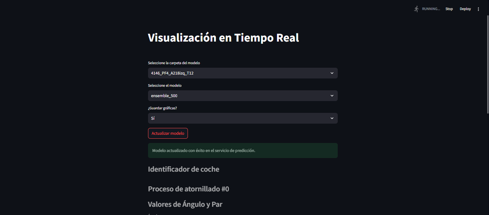

# Tutorial de Uso

#### Requisitos Previos

* **Python** : Asegúrate de tener Python 3.8 o superior instalado en tu sistema.
* **Librerías** : Instala las librerías necesarias ejecutando el siguiente comando en tu terminal:

```bash
pip install -r requirements.txt
```

#### Archivos y Carpetas

**Carpeta de Modelos** :

* Ubicada en `Proyecto_Fiverr\modelos`.
* Contiene las carpetas con los modelos `.pkl` y escaladores correspondientes.

**Archivo de Datos** :

* Ubicado en `\Proyecto_Fiverr\src\data`.

#### Modificaciones Necesarias

* **visualization_service.py** :
* Verificar la ruta de la carpeta de modelos y el archivo de sonido de alerta.
* **model_service.py** :
* Verificar las rutas para cargar los modelos y escaladores.
* **prediction_service.py** :
* Asegurar que las rutas del servicio de predicción sean correctas.
* **data_dispatcher.py** :
* Modificar la ruta del archivo Excel y el tamaño de ventana según sea necesario.

#### Iniciar Servicios

* **Iniciar Todos los Servicios** :
* Lo primero es acceder al folder app.
* Usar el archivo `main.py` para iniciar todos los servicios:

```
python main.py
```

**O bien, se pueden iniciar los servicios por separado**

* **Servicio de Predicción** :
* Iniciado por `model_service.py`.
* Ejecutar:

```bash
uvicorn model_service:app --host 0.0.0.0 --port 8000
```

* **Servicio de Datos** :
* Iniciado por `prediction_service.py`.
* Ejecutar:

```
uvicorn prediction_service:app --host 127.0.0.1 --port 8001
```

* **Servicio de Streamlit** :
* Iniciado por `visualization_service.py`.
* Ejecutar:

```
streamlit run visualization_service.py
```

#### Despachador de Datos

Recuerda seleccionar el modelo correspondiente en la aplicación web antes de iniciar el proceso de despachar datos.



* El despachador de datos (`despachador_datos.py`) procesa el archivo Excel y envía datos al servicio de datos.
* Ejecutar:

```
python despachador_datos.py
```
